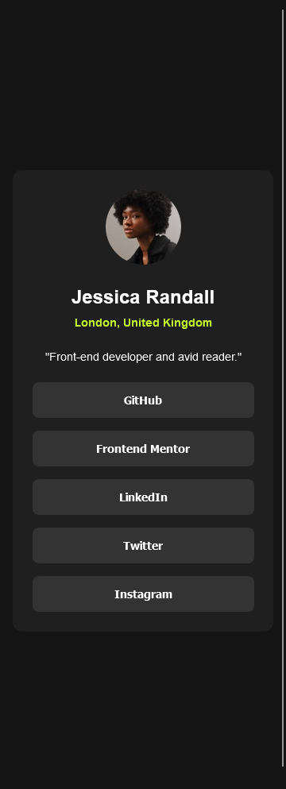

# Frontend Mentor - Social links profile solution

This is a solution to the [Social links profile challenge on Frontend Mentor](https://www.frontendmentor.io/challenges/social-links-profile-UG32l9m6dQ). Frontend Mentor challenges help you improve your coding skills by building realistic projects.

## Table of contents

- [Overview](#overview)
  - [The challenge](#the-challenge)
  - [Screenshot](#screenshot)
  - [Links](#links)
  - [Built with](#built-with)
- [Author](#author)

## Overview

This is my implementation for [Social Link Profile clallenge on Frontend Mentor](https://www.frontendmentor.io/challenges/social-links-profile-UG32l9m6dQ)

### The challenge

Users should be able to:

- See hover and focus states for all interactive elements on the page
- Again, have right sizes for the elements was crucial, all of them were measured with a ruler because if I base it on the Figma file, it does not turn out the same

### Screenshot

### Links

- Live Site URL: [Visit Site](https://my-fm-social-link-profile.netlify.app/)

### Built with

- Semantic HTML5 markup
- CSS custom properties
- Flexbox
- CSS Grid
- Mobile-first workflow

## Author

- Website - [Luis Manuel Mendoza Guerrero](https://github.com/LMCyber)
- Frontend Mentor - [@LMCyber](https://www.frontendmentor.io/profile/LMCyber)
